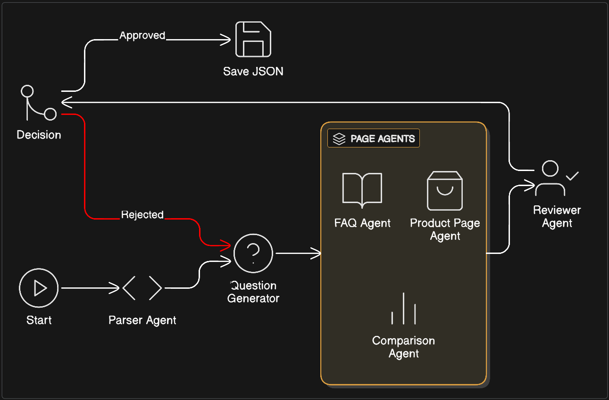
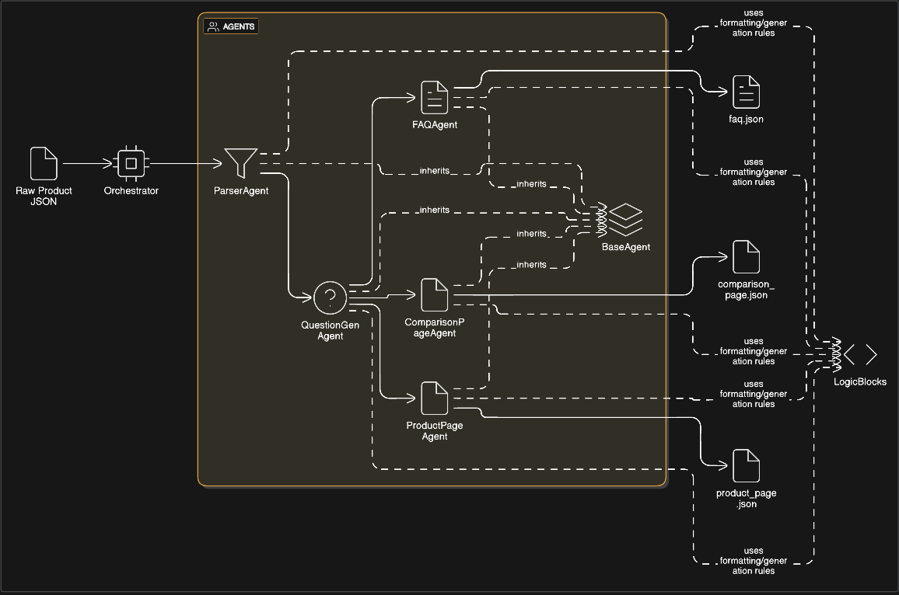

# Project Documentation: Agentic Content Generation System

## 1. Executive Summary
This project implements an **LLM-driven agentic pipeline** for automating e-commerce content creation. The system uses a **Directed Acyclic Graph (DAG) with cyclic capabilities** powered by **Google Gemini** to generate, validate, and refine high-quality structured content (FAQs, Product Pages, Comparisons).

**Key Improvements (Latest Version)**:
- ✅ All content is LLM-generated only (no mocks or external search)
- ✅ FAQ validation enforces minimum 15 questions
- ✅ Retry mechanisms with exponential backoff
- ✅ Content quality validators beyond schema checks
- ✅ Real integration tests with actual API calls
- ✅ Enhanced error tracking and state management

## 2. System Architecture

### 2.1. Core Frameworks
- **LangGraph**: Manages orchestration, state, and control flow (DAG with cycles)
- **LangChain**: Provides the interface for LLM interaction and prompt management
- **Pydantic**: Enforces strict data validation and schema compliance with custom validators
- **Google Gemini (`gemini-1.5-flash`)**: The underlying intelligence engine

### 2.2. Architecture Diagrams



*Note: The system implements a **Cyclic Graph**. If the Reviewer Agent rejects content, the flow loops back to the Question Generator for regeneration (max 3 retries).*

### 2.3. Data Flow
1. **Ingestion**: Raw JSON data is loaded into the `AgentState`
2. **Parsing Node**: The **Parser Agent** normalizes data with retry logic
3. **Reasoning Node**: The **Question Generator Agent** creates 15+ strategic questions
4. **Generation Nodes (Parallel)**: FAQ, Product Page, and Comparison Agents generate content
5. **Review Node**: The **Reviewer Agent** validates output against quality criteria
   - **Pass**: Pipeline finishes
   - **Fail**: Feedback is added to state, and flow **loops back** to Step 3 (max 3 retries)
6. **Output**: Final JSON artifacts are validated and saved

## 3. Agent Specifications

### 3.1. Parser Agent
- **Goal**: Data Normalization
- **Input**: Raw Dictionary
- **Output**: `ProductSchema` (Pydantic with validators)
- **Logic**: Uses LLM to extract structured fields from unstructured text
- **Retry**: Up to 3 attempts with exponential backoff
- **Validation**: Business requirement validators for price, currency, features

### 3.2. Question Generator Agent
- **Goal**: User Intent Prediction
- **Input**: `ProductSchema`
- **Output**: `List[QuestionSchema]` (minimum 15 questions)
- **Logic**: Generates questions across 4 categories (Usage, Safety, Purchase, Informational)
- **Retry**: Up to 5 attempts with exponential backoff
- **Validation**: Enforces minimum 15 questions with category diversity

### 3.3. Page Agents
- **Goal**: Content Synthesis
- **Input**: `ProductSchema` + `List[QuestionSchema]`
- **Output**: Page-specific Schemas (`FAQPageSchema`, `ProductPageSchema`, `ComparisonPageSchema`)
- **Logic**: Uses role-playing prompts (e.g., "You are a Copywriting Expert") to generate persuasive text
- **Retry**: Up to 3 attempts per agent with exponential backoff
- **Validation**: Content quality validators check for completeness and external search prevention

### 3.4. Reviewer Agent
- **Goal**: Quality Assurance
- **Input**: All generated pages
- **Output**: Approval/rejection with feedback
- **Logic**: Validates FAQ count (≥15), content quality, and absence of external search indicators
- **Retry**: Up to 2 attempts with exponential backoff
- **Critical Fix**: Syntax error on line 48 has been fixed

## 4. Robustness & Reliability

### 4.1. State Management
- Centralized `AgentState` with enhanced error tracking
- Retry attempt tracking per agent
- Quality metrics (FAQ count, validation status)
- Error propagation with detailed messages

### 4.2. Error Handling
- **Retry Mechanisms**: Exponential backoff with configurable limits per agent
- **Validation**: Multi-layer validation (schema + business requirements + content quality)
- **Error Propagation**: Errors are tracked and logged, not silently ignored
- **Graceful Degradation**: System attempts recovery but fails explicitly when limits are reached

### 4.3. Conditional Logic
- Graph includes checks (e.g., "Did parsing succeed?") to prevent cascading failures
- Self-correction loop with maximum retry limit (3 attempts)
- Early termination on critical failures

### 4.4. Schema Validation
- All LLM outputs are forced into Pydantic models
- Custom validators for business requirements (price, currency, FAQ count)
- Content quality validators (external search prevention, minimum lengths)
- Guaranteed valid JSON output

## 5. Testing Strategy

### 5.1. Integration Tests (Real LLM Calls)
- End-to-end pipeline execution with actual Gemini API
- FAQ count validation (≥15 questions)
- Question generation minimum (≥15 with category diversity)
- External search indicator detection
- Self-correction loop verification

### 5.2. Unit Tests
- Schema validation tests
- Content quality validator tests
- Business requirement validator tests
- Edge case and boundary condition tests

### 5.3. Test Execution
```bash
# Fast unit tests
pytest tests/test_schemas.py -v

# Slow integration tests (uses real API)
pytest tests/test_integration.py -v -m slow
```

## 6. System Limitations

### 6.1. Current Constraints
- **No Tool Usage**: Agents are prompt-based without external tool integration
- **Limited Agentic Reasoning**: State passing around LLM calls, not deeply agentic
- **No External Search**: System explicitly prevents external search (by design)
- **API Costs**: Real LLM calls consume credits - no mocking in production
- **Basic Parallelization**: Page agents run in parallel but coordination is limited

### 6.2. Not Implemented
- Advanced tool usage (web search, calculators, databases)
- Multi-modal capabilities (images, videos)
- Database persistence
- Caching mechanisms
- Advanced monitoring/observability
- Multi-language support

## 5. Setup & Configuration
1.  **Environment**: Create a `.env` file with `GOOGLE_API_KEY`.
2.  **Dependencies**: `pip install -r requirements.txt` (or manually install `langchain`, `langgraph`, `pydantic`, `python-dotenv`, `langchain-google-genai`).
3.  **Execution**: Run `python src/main_graph.py`.
